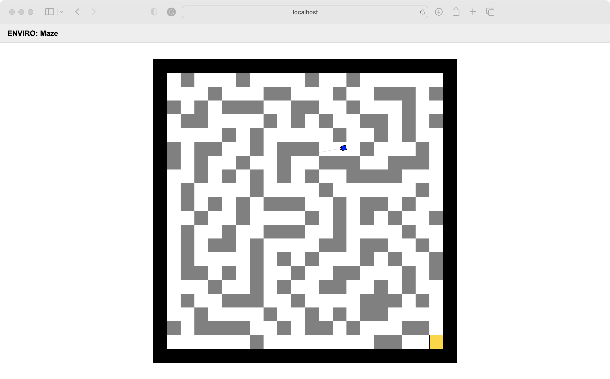

# Maze-Solving Robot Simulation in ENVIRO

# Overview

This project introduces an autonomous maze-solving robot simulation built on the ENVIRO platform. The robot is designed to navigate through randomly generated mazes with a unique start and goal point determined by `maze.cc`. The `path.cc` component finds the shortest path from start to goal, while `main.cc` compiles the project into an executable. The robot utilizes sophisticated algorithms and sensor integration to explore and solve the maze, showcasing a practical application of embedded systems concepts.

# Key Challenges and Solutions

- **Maze Generation**: The `maze.cc` file implements a random perfect maze generator with randomized start and goal positions.

- **Pathfinding**: The `path.cc` file is responsible for computing the shortest path through the maze using an efficient pathfinding algorithm.

- **State Management for Autonomous Behavior**: Ensuring the robot could make intelligent decisions at intersections and dead-ends required robust state management. The `wanderer.h` file includes the definition of different states for movement, such as moving forward, rotating, and wall-following, and handles transitions between these states smoothly.

- **Memory and Path Optimization**: The robot needed a system to remember where it had been to avoid revisiting the same locations and efficiently find the exit. `wanderer.h` facilitates this by managing a list of coordinates that represent the path the robot has taken, ensuring it does not backtrack and always progresses towards the goal.

# Installation / Setup Instructions

Make sure Docker is installed on your machine. Use the following commands to clone the repository and navigate to the project directory:

## Clone the project repository
git clone https://github.com/WarlockEdwinLu/EEP520_final_prject.git

## Navigate to the project directory
cd EEP520_final_prject

## Running the Simulation

With Docker installed, run the following commands to start the Docker container and launch the simulation environment:

## Command to start the Docker container
docker run -p80:80 -p8765:8765 -v $PWD:/source -it klavins/enviro:v1.61 bash

## Command to start Maze generation and path finding
cd src  
g++ -std=c++17 -o main main.cc maze.cc path.cc  
./main  
cd ..  

## Command to build and start the simulation
make clean  
make  
esm start  
enviro  

Once running, access the simulation through your web browser at http://localhost.

## Using the Simulation

- The robot begins at the designated start position and will autonomiously navigate towards the goal using the shortest path algorithm.

- The range sensors on the robot help it avoid collisions and follow the path accurately.
- To restart the simulation with a new maze, stop the running environment and start it again. The maze will be regenerated, and the robot will find a new path.

# Project Structure

defs/: Definitions of the robot and environment settings in JSON format.
lib/: Contains the shared object files for the simulation.
src/: Source code directory with the main simulation logic:
main.cc: Compiles the project into an executable.
maze.cc: Generates a random perfect maze and determines start and goal positions.
path.cc: Calculates the shortest path from the start to the goal.
config.json: Configuration settings for the initial simulation state.

# Results

The following images showcase the maze-solving robot simulation in action:

The robot in the process of solving the maze.

The robot has reached the goal, successfully solving the maze.

# Contributions and Acknowledgements

This project was developed by Jiajun Lu. It is built upon the ENVIRO from klavins/enviro:v1.6. Referenced from https://github.com/sosper30/eep520-wi24/blob/main/week9/Lecture9-1_README.md 
# License

This project is licensed under the MIT License - see the LICENSE file for details.